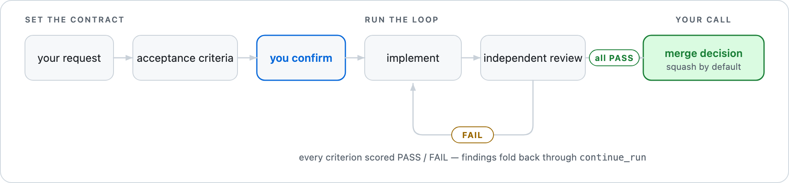

# crew-iterate

Most agent runs end when the agent decides it is finished. `crew-iterate`
ends when *your* standard is met.

You say what "done" means. The captain turns that into a handful of
acceptance criteria you confirm, then implementation and independent review
repeat — re-scoring the full criteria list every round — until every
criterion passes and every reviewer approves. Nothing lands until you say so.

<picture>
  <source media="(prefers-color-scheme: dark)" srcset="../assets/crew-iterate-dark.png">
  
</picture>

## When to reach for it

Use `crew-iterate` when the work has to clear a bar: a suite that must go
green, a refactor that must not change behavior, a change you want a second
model to sign off on before it touches your branch.

Use the umbrella `crew` workflow instead for a one-shot implementation,
review-only work, or an explicit "no review" request.

## Start an iteration

Ask naturally:

> Keep working on the rate limiter until the tests pass and independent
> reviewers approve it.

Or invoke the installed skill directly:

```text
/crew-iterate Implement the rate limiter and iterate until it is ready to ship.
```

The exact slash-command presentation depends on the host, but the installed
skill name is `crew-iterate` in Claude Code, Codex, and agy.

## A run, end to end

**1. You confirm the contract.** Before anything is dispatched, the captain
proposes three to seven acceptance criteria and prints them as a table you can
actually read:

| # | Criterion | Type | Detail | Signal |
| --- | --- | --- | --- | --- |
| 1 | **Test suite passes** | [M] | Full unit suite green, including new rate-limiter cases | `npm run test:run` |
| 2 | **Type check is clean** | [M] | No new strict-mode errors | `npm run lint` |
| 3 | **Limits are per-caller** | [B] | Buckets keyed by caller identity, not process-global | — |
| 4 | **Rejections are observable** | [B] | A throttled request returns 429 and increments a counter | — |
| 5 | **Traffic under the limit is unchanged** | [N] | No behavior change for requests that never throttle | — |

It also proposes the roster: one implementer, the Crew reviewers, and the
host-native reviewer. Edit either proposal, or approve it. Silence is not
consent — nothing dispatches until you answer.

**2. One implementer builds.** A single write run in an isolated git
worktree. The captain reports the dispatch and hands the conversation back to
you; a watcher wakes it when the run becomes terminal or when a 10-minute
check-in is due. At each check-in the captain reads and reports current status,
then re-arms the next interval if the implementer is still running. Crew never
holds the turn open by polling, a check-in does not start review, and a wake by
itself authorizes nothing — not continuation, not cleanup, not merge.

**3. Reviewers score every criterion.** The confirmed Crew reviewers and the
host-native reviewer each read the full diff and return a complete
PASS/FAIL score with `file:line` evidence — a full review each, not a
concern-sliced one. The panel watcher checks in on the same 10-minute
cadence as the implementer, so a long review round reports progress instead
of going silent until the last reviewer lands.

**4. The captain re-runs the mechanics itself.** Every `[M]` command runs
again in the implementer's worktree, and that result overrides any reviewer's
`[M]` score. Reviewers are read-only, and read-only sandboxes fail for
environmental reasons that have nothing to do with your code.

**5. Findings fold back.** Any FAIL or `CHANGES_NEEDED` goes back to the same
worktree through `continue_run`, and the next round re-scores the *full*
criteria set — not just what failed last time. Fixing criterion 3 cannot
quietly break criterion 5.

**6. You decide the merge.** On convergence the captain presents the proposed
commit title and body and asks. Convergence never implies merge permission.

## What you decide

| Decision | Asked | If you stay silent |
| --- | --- | --- |
| The acceptance criteria | Before implementation, and again after any revision | Nothing dispatches |
| The roster of implementer and reviewers | Before implementation, and again after any change to it | Dispatch stays paused |
| Whether an eligible Claude implementer may use a bounded `/goal` inner loop | Only when every eligibility gate holds | Off — normal single-shot dispatch |
| How to proceed at a round cap or a `BLOCKING` verdict | When it happens | The loop pauses |
| Whether the converged work merges | At convergence | Nothing merges |

## Writing criteria that work

Each criterion carries a type, because the type decides *who establishes
truth*:

- **`[M]` mechanical** — a test, lint, build, or file-content assertion with a
  binary signal. The captain owns it by re-running it.
- **`[B]` behavioral** — a property a reviewer can confirm by reading the diff
  and citing `file:line`.
- **`[N]` negative** — a "doesn't break X" guard on load-bearing code the
  change touches.

Avoid pure-vibes criteria ("looks idiomatic", "feels clean") unless you pair
them with a concrete signal, and avoid claims no reviewer can check from the
diff unless you also dispatch a benchmark or equivalent.

Changing criteria mid-loop opens a **new epoch**: the revised set is snapshot,
returns to `proposed` for your confirmation, resets the per-epoch round
counter, and the next round re-scores the full revised list.

## Round limits

By default the captain pauses after 3 rounds in an epoch or 9 rounds overall.
These are stop-and-ask points, not failures — the captain reports where the
loop stands and asks how you want to proceed. Both are configurable through
`iterate.maxRoundsPerEpoch` and `iterate.maxTotalRounds`; see
[Configuration](configuration.md).

## Convergence and merge

The loop converges only when:

- every captain-owned `[M]` command passes;
- every `[B]` and `[N]` criterion is `PASS`, except an `N-A` you explicitly
  accepted;
- every reviewer returns a well-formed `APPROVE`; and
- no unresolved critical or major finding remains.

Squash is the default merge strategy after your approval, because iteration
naturally produces implementation and fixup commits.

## Advanced: the bounded Claude `/goal` inner loop

For mechanical fix-and-check work — run the tests, fix, run again — a round
trip through the captain is expensive. Claude Code's native `/goal` can absorb
that retry loop inside a single implementer dispatch. It is a bounded
execution primitive, not a second orchestrator.

Do not confuse the two slash commands:

- `/crew-iterate` starts Crew's criteria, implementation, review, and
  merge-decision workflow.
- Claude `/goal` is a provider control message Crew may send inside the
  implementer's dispatch, after you separately opt in.

### You opt in explicitly

Native goals are never inferred from a normal `crew-iterate` request.
Choosing Claude as the implementer is not consent. Confirming an `[M]`
criterion is not consent. The captain proposes a concrete choice:

> Let Claude use a bounded `/goal` loop for `npm run test:run` — up to six
> turns or five minutes — or use a normal single-shot dispatch?

Only an explicit affirmative permits the captain to attach `goal` to
`run_agent`. You never type the provider command yourself; Crew sends it
through the Claude adapter.

### Eligibility

All of these must hold:

- you explicitly opted in;
- the confirmed implementer is Claude Code;
- the run is a write implementation, not a review or ephemeral run;
- one `[M]` criterion supplies one single-line validation command;
- that command is safe to execute repeatedly; and
- the goal is bounded to 1–20 turns and 1,000–600,000 ms, below Crew's outer
  watchdog.

The worker is told to stop on infrastructure, permission, or dependency
failure rather than grinding on a condition it cannot establish.

### Invocation

The goal rides along with the ordinary Crew dispatch:

```text
run_agent({
  agent_id: "claude-code",
  criteria_set_id: "criteria-...",
  goal: {
    validation_command: "npm run test:run",
    repeat_safe: true,
    max_turns: 6,
    max_wall_clock_ms: 300000
  },
  prompt: "Implement the change, run every [M] check, and report results."
})
```

Crew converts that into separate Claude stream messages. Conceptually:

```text
/goal A fresh execution of this explicitly repeat-safe validation command
exits 0: "npm run test:run". Stop immediately and report blocked if
infrastructure, permissions, or dependencies prevent validation.

<ordinary implementation prompt>
```

The validation command is provider prompt data — Crew does not execute it as
part of setting `/goal`. After the run is terminal the captain independently
reruns the corresponding `[M]` command anyway. Native goal success alone never
proves Crew convergence.

### Continuations

`continue_run` defaults `goal_policy` to `clear` so new review findings cannot
accidentally resume a stale provider objective.

| Policy | Behavior | Required intent |
| --- | --- | --- |
| `clear` | Sends `/goal clear` before the new work prompt. This is the default. | No additional opt-in. |
| `inherit` | Retains the same nonterminal native objective. | You explicitly want it retained. |
| `replace` | Clears the old objective and sets a newly supplied goal. | You confirm the replacement. |

Inherited and replacement goals draw down the original run's cumulative turn
and wall-clock budget; a continuation cannot reset or raise that ceiling. If
Claude does not authoritatively confirm a clear, the next default-clear
continuation retries it rather than silently resuming the stale goal.

### Outcomes

The captain reads the structured `goal.outcome` from Crew status, never a
worker's prose claim:

```text
not_requested  unsupported  achieved  impossible  turn_capped
watchdog_timeout  cancelled  provider_error  evaluator_error
```

Outcomes must come from trusted provider control or status events. If Crew
cannot establish an authoritative outcome it fails closed as
`evaluator_error`, and the captain investigates instead of assuming success.

### Why the goal stays inside one dispatch

Crew must remain the single continuation owner. A captain-level goal like
"continue until all criteria pass and all reviewers approve" would compete
with Crew's watchers and durable run state, producing:

- duplicate or conflicting continuations;
- provider work continuing on stale instructions after review findings;
- disagreement between provider goal state, Crew watchdogs, and round caps;
- repeated wakes that rediscover nonterminal runs with no actionable event;
- a weak transcript evaluator making review, terminal, or merge decisions.

The inner boundary keeps the useful part — retrying mechanical work without a
captain round trip — while Crew keeps criteria, review cadence, watchers,
cumulative budgets, terminal decisions, and the merge gate.

### Codex goals are unsupported

Do not offer a native goal when Codex is the implementer, and do not use the
Codex captain's `/goal` to drive the outer loop. An isolated lifecycle spike
found both required gates missing:

1. `codex exec --json` ended after the first public turn instead of keeping an
   autonomous multi-turn goal process alive.
2. Its public JSONL exposed no stable machine-readable terminal goal event.

Without both, Crew cannot put the provider loop beneath its watchdog or tell
achieved, impossible, interrupted, and still-active apart. A goal sent to an
unsupported provider is recorded as `unsupported` and Crew performs one
ordinary dispatch. Codex workers use Crew's explicit `continue_run` outer
loop; native support should be revisited only after a new spike proves both
gates.

## Related references

- [Canonical skill body](../../skills/crew-iterate.body.md) — the installed
  captain playbook and safety invariants.
- [Configuration](configuration.md) — implementer/reviewer defaults and
  iteration limits.
- [MCP tool surface](../architecture/tools.md) — criteria, dispatch, status,
  bounded goal, and continuation contracts.
- [Adapter contracts](../architecture/adapters.md) — Claude `/goal` encoding,
  trusted outcome parsing, and the Codex lifecycle decision.
- [Run-state contract](../architecture/run-state-contract.md) — durable
  criteria, prompt, goal, and budget records.
